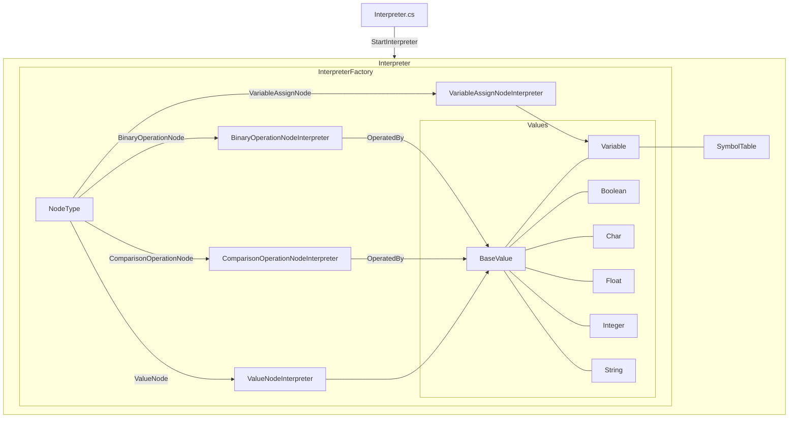

## Structural Diagrams

```mermaid
flowchart TB
  Interpreter.cs--StartInterpreter-->Interpreter

subgraph Interpreter
    direction LR
  subgraph InterpreterFactory
    NodeType--VariableAssignNode-->VariableAssignNodeInterpreter-->Variable
    NodeType--BinaryOperationNode-->BinaryOperationNodeInterpreter--OperatedBy-->BaseValue
    NodeType--ComparisonOperationNode-->ComparisonOperationNodeInterpreter--OperatedBy-->BaseValue
    NodeType--ValueNode-->ValueNodeInterpreter-->BaseValue
  subgraph Values
    direction TB
    BaseValue---Boolean
    BaseValue---Char
    BaseValue---Float
    BaseValue---Integer
    BaseValue---String
    BaseValue---Variable
  end
  end
  Variable---SymbolTable
end 

```