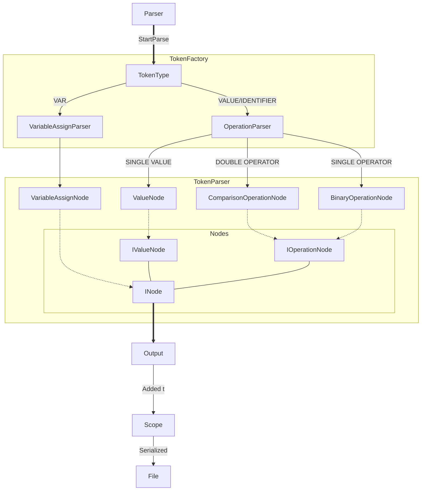

## Structural Diagrams

```mermaid
flowchart TB
    Parser==StartParse==>TokenType

    subgraph TokenFactory
        direction LR
        TokenType--VAR-->VariableAssignParser
        TokenType--VALUE/IDENTIFIER-->OperationParser
    end

    subgraph TokenParser
        direction LR
        VariableAssignParser-->VariableAssignNode
        OperationParser--DOUBLE OPERATOR-->ComparisonOperationNode
        OperationParser--SINGLE OPERATOR-->BinaryOperationNode
        OperationParser--SINGLE VALUE-->ValueNode

        VariableAssignNode-.->INode
        ComparisonOperationNode-.->IOperationNode 
        BinaryOperationNode-.->IOperationNode
        ValueNode-.->IValueNode

        subgraph Nodes
            direction TB
            IValueNode ---INode
            IOperationNode ---INode

        end

    end

    INode==>Output
    Output--Added to-->Scope
    Scope--Serialized-->File 


```

Parser -> StartParse() -> ParserFactory -> TokenParser-> INode